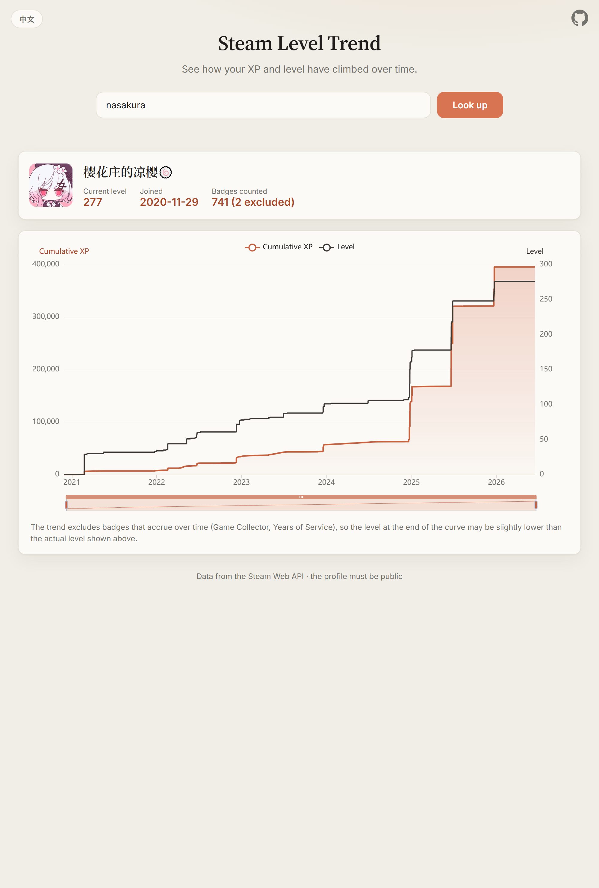

# Steam Level Trend

**English** · [中文](README_ZH.md)

Plot how a Steam account's **cumulative XP** and **level** have grown over time, reconstructed from when each badge was earned. Works for any public profile and is meant to be deployed publicly.



## Features

- **Many identifier formats** — custom URL name (vanity), SteamID64, friend code / account id, SteamID3 `[U:1:W]`, SteamID2 `STEAM_X:Y:Z`, or a full profile link.
- **Dual-axis trend** — cumulative XP curve + level step line, with zoom and per-point tooltips.
- **Zero-config caching** — uses the Worker Cache API (no KV namespace required).

## How it works

The Steam Web API `IPlayerService/GetBadges` returns each badge's `completion_time` and `xp`. Sorting by time and accumulating the XP reconstructs the curve; Steam's XP formula then converts cumulative XP back into a level at each point.

- A single developer API key can query **any public profile**.
- Badges that accrue over time are excluded by default, because their `completion_time` only reflects the most recent upgrade and would compress history into one point:
  - `13` Game Collector (grows with games owned)
  - `1` Years of Service (increments yearly)
- These special badges are matched **only when they have no `appid`** — regular trading-card badges also use `badgeid` 1/2 but are keyed by `appid`, so they are never dropped.

## Prerequisites

1. [Node.js](https://nodejs.org/) 18+.
2. A Steam Web API key: <https://steamcommunity.com/dev/apikey> (free, requires a Steam login).

## Local development

```bash
npm install                       # installs wrangler
cp .dev.vars.example .dev.vars    # then put your key in .dev.vars
npm run dev                       # serves at http://localhost:8787
```

Open the local URL and enter any of: a custom URL name (e.g. `nasakura`), SteamID64, friend code, SteamID3, or a full profile link.

## Deploy to Cloudflare

```bash
npx wrangler login                          # first time only
npx wrangler secret put STEAM_API_KEY       # paste your key (stored encrypted)
npm run deploy
```

If you deploy via the **dashboard / connected GitHub repo** instead of the CLI, add the key under **Workers & Pages → your Worker → Settings → Variables and Secrets**: add `STEAM_API_KEY` as a **Secret** (not plaintext). A dashboard secret is preserved across Git-triggered builds.

> Caching uses the Worker's built-in Cache API (`caches.default`) — **no KV namespace needed**. Results are cached for 12 hours.

## Tests

```bash
npm test     # node --test — covers XP↔level math, the timeline transform, and Worker orchestration
```

## Customizing

- **Excluded badges** — edit `EXCLUDED_BADGE_IDS` in [`src/config.js`](src/config.js) (cross-reference <https://steamdb.info/badges/>).
- **Cache duration** — `CACHE_TTL.profile` (seconds) in the same file.
- **Theme / chart** — colors live in [`public/styles.css`](public/styles.css) and the ECharts options in [`public/app.js`](public/app.js).
- **UI strings** — the `I18N` dictionaries at the top of [`public/app.js`](public/app.js).

## Notes

- The target profile must have **game details / badges set to public**, otherwise the API returns nothing and the page says so.
- Because accruing badges are excluded, the level at the end of the curve can be slightly lower than the **actual** level shown in the summary card (which comes straight from the API).
- If a card badge was leveled up to a high tier only recently, all of its XP is recorded at that most recent timestamp — a limitation of the underlying Steam data.

## Project structure

```
src/
  worker.js      Worker entry: /api/profile proxy + static-asset fallback
  steamClient.js Steam API wrappers + identifier parsing
  transform.js   pure: badges → chart time series
  levelMath.js   pure: XP ↔ level conversion
  config.js      excluded badges, cache TTL, constants
public/
  index.html / styles.css / app.js   single-page frontend (ECharts, i18n)
test/
  core.test.js   pure-function tests
  worker.test.js Worker orchestration tests (mocked globals)
```
