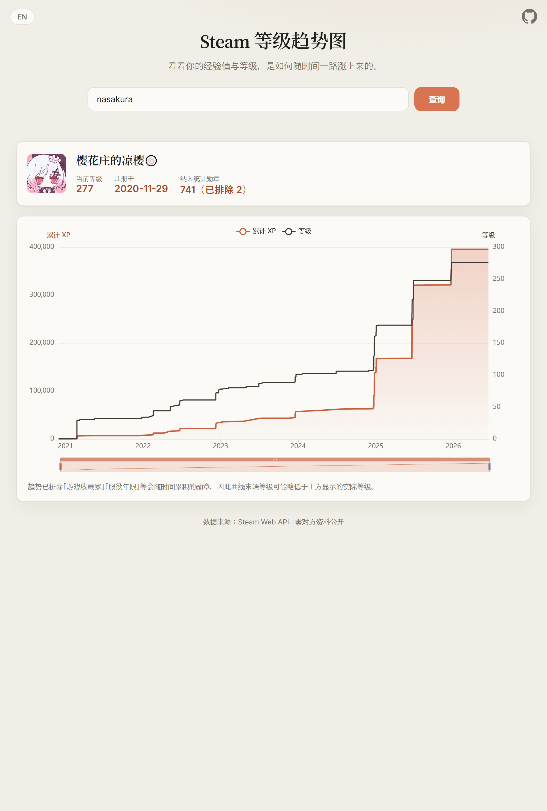

# Steam 等级趋势图

[English](README.md) · **中文**

根据 Steam 勋章的获得时间与经验，绘制「从注册到现在」的**累计经验值**与**等级**随时间变化的双轴折线图。任何资料公开的用户都能查询，可公开部署给他人使用。



## 功能特性

- **多种识别码** —— 自定义 URL 名（vanity）、SteamID64、好友代码 / account id、SteamID3 `[U:1:W]`、SteamID2 `STEAM_X:Y:Z`，或完整资料链接。
- **双轴趋势** —— 累计 XP 曲线 + 等级阶梯线，支持缩放与逐点提示。
- **零配置缓存** —— 使用 Worker 内置 Cache API（无需创建 KV）。

## 工作原理

Steam 官方 Web API `IPlayerService/GetBadges` 会返回每个勋章的 `completion_time`（获得时间）与 `xp`（经验）。把它们按时间排序并逐条累加即可重建经验曲线，再用 Steam 的经验公式换算出每一刻的等级。

- 一个开发者的 API key 即可查询**任意公开资料**的用户。
- 默认排除会随时间累积的勋章（它们的 `completion_time` 只反映最近一次升级，会把历史压缩到一个时间点）：
  - `13` 游戏收藏家（随拥有游戏数增长）
  - `1` 服役年限（每年递增）
- 这些特殊勋章**仅在没有 `appid` 时**才命中排除——普通卡牌勋章的 `badgeid` 也可能是 1/2，但靠 `appid` 区分，绝不会被误删。

## 准备

1. 安装 [Node.js](https://nodejs.org/) 18+。
2. 申请 Steam Web API Key：<https://steamcommunity.com/dev/apikey>（免费，需登录 Steam 账号）。

## 本地开发

```bash
npm install                       # 安装 wrangler
cp .dev.vars.example .dev.vars    # 然后在 .dev.vars 里填入你的 key
npm run dev                       # 启动本地服务（默认 http://localhost:8787）
```

打开本地地址，输入下列任一识别码即可：自定义 URL 名（如 `nasakura`）、SteamID64、好友代码、SteamID3 或完整资料链接。

## 部署到 Cloudflare

```bash
npx wrangler login                          # 首次需登录
npx wrangler secret put STEAM_API_KEY       # 粘贴你的 key（加密保存）
npm run deploy
```

若用**面板 / 连接 GitHub 仓库**自动部署，则在 **Workers & Pages → 你的 Worker → Settings → Variables and Secrets** 里添加 `STEAM_API_KEY`，类型选 **Secret（机密）** 而非明文。面板里设的 secret 在每次 Git 触发的构建后都会保留。

> 缓存使用 Worker 内置 Cache API（`caches.default`），**无需创建 KV**，处理结果默认缓存 12 小时。

## 测试

```bash
npm test     # node --test，覆盖经验↔等级换算、时间序列加工与 Worker 编排
```

## 自定义

- **排除的勋章** —— 编辑 [`src/config.js`](src/config.js) 的 `EXCLUDED_BADGE_IDS`（对照 <https://steamdb.info/badges/>）。
- **缓存时长** —— 同文件的 `CACHE_TTL.profile`（秒）。
- **主题 / 图表** —— 配色在 [`public/styles.css`](public/styles.css)，ECharts 配置在 [`public/app.js`](public/app.js)。
- **界面文案** —— [`public/app.js`](public/app.js) 顶部的 `I18N` 字典。

## 注意事项

- 目标用户需把**游戏详情 / 勋章设为公开**，否则接口返回空，页面会提示。
- 因排除了累积型勋章，曲线末端等级可能略低于概要卡里显示的**实际等级**（实际等级直接来自 API）。
- 卡牌勋章若是后来才升级到高等级，其全部经验会记在最后一次升级的时间点——这是 Steam 数据本身的限制。

## 目录结构

```
src/
  worker.js      Worker 入口：/api/profile 代理 + 静态资源回退
  steamClient.js Steam API 封装 + 输入解析
  transform.js   纯函数：badges → 画图时间序列
  levelMath.js   纯函数：经验 ↔ 等级换算
  config.js      排除名单、缓存时长等常量
public/
  index.html / styles.css / app.js   单页前端（ECharts、i18n）
test/
  core.test.js   纯函数测试
  worker.test.js Worker 编排测试（mock 全局）
```
